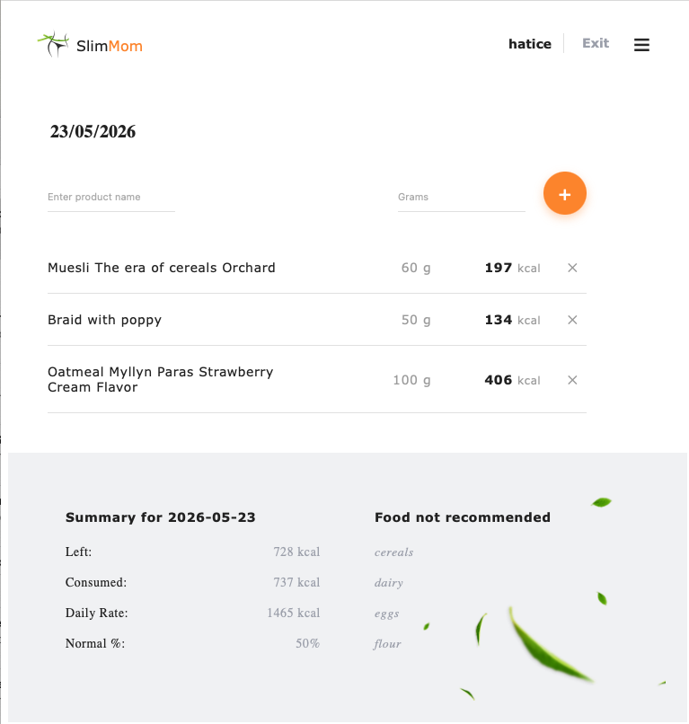

# 🥗 Slim Mom — Full Stack Nutrition Tracker

A modern full-stack calorie tracking and diet management application built with **React, Redux Toolkit, Node.js, Express, and MongoDB**.

Slim Mom helps users calculate their daily calorie intake, track consumed foods, and manage healthy nutrition habits through a responsive and dynamic user experience.

---

# 🚀 Live Demo

### 🌐 Frontend (Vercel)

[Slim Mom Live App](https://slim-moms-seven.vercel.app)

### ⚙️ Backend API

[Backend API Server](https://slim-moms-backend-xkg6.onrender.com)

### 📘 Swagger API Documentation

[Swagger API Docs](https://slim-moms-backend-xkg6.onrender.com/api-docs)

### 💻 GitHub Repository

[GitHub Repository](https://github.com/HaticevanD/slim-moms)

---

# 📸 Project Preview

## Landing Page


## Diary Page



## Calculator Page


---

# ✨ Features

## 🔐 Authentication System

- User registration & login
- JWT authentication
- Refresh token session handling
- Protected routes
- Persistent login state

## 🥗 Daily Diary Tracking

- Add consumed foods
- Remove diary products
- Real-time calorie calculations
- Dynamic daily summary updates

## 📊 Calorie Calculator

- Daily calorie intake calculation
- Blood-type-based diet recommendations
- Forbidden food categories system
- Personalized diet data persistence

## 📱 Fully Responsive Design

- Mobile-first architecture
- Tablet optimization
- Desktop adaptive layouts
- Burger menu navigation

---

# 🧠 Tech Stack

## Frontend

- React
- Redux Toolkit
- React Router DOM
- Axios
- Formik + Yup
- CSS Modules
- Redux Persist
- React Hot Toast
- React Datepicker

## Backend

- Node.js
- Express.js
- MongoDB + Mongoose
- JWT Authentication
- Joi Validation
- Swagger Documentation

## Developer Tools

- Git & GitHub
- ESLint
- Prettier
- Nodemon
- Jest
- Supertest

---

# 🏗️ Architecture

## Frontend Structure

client/
├── components/
├── pages/
├── redux/
├── api/
├── hooks/
└── styles/

## Backend Structure

server/
├── controllers/
├── routes/
├── models/
├── middlewares/
├── services/
├── validation/
└── utils/

---

# 🔄 API Overview

| Method | Endpoint                     | Description                |
| ------ | ---------------------------- | -------------------------- |
| POST   | /api/auth/register           | Register user              |
| POST   | /api/auth/login              | Login user                 |
| POST   | /api/auth/logout             | Logout user                |
| POST   | /api/products/public-calorie | Public calorie calculation |
| POST   | /api/products/user-calorie   | Save user calorie data     |
| GET    | /api/diary/:date             | Get diary by date          |
| POST   | /api/diary                   | Add diary product          |
| DELETE | /api/diary/:date/product/:id | Remove diary product       |

---

# ⚡ Installation

## 1. Clone Repository

```bash
git clone https://github.com/HaticevanD/slim-moms.git
```

---

## 2. Install Frontend

```bash
cd client
npm install
npm run dev
```

---

## 3. Install Backend

```bash
cd server
npm install
npm run dev
```

---

# 🔑 Environment Variables

## Backend (.env)

```env
PORT=8080
MONGO_URI=YOUR_MONGODB_URI
JWT_SECRET=YOUR_SECRET
REFRESH_TOKEN_SECRET=YOUR_REFRESH_SECRET
```

## Frontend (.env)

```env
VITE_API_URL=http://localhost:8080/api
```

---

# 🧪 Testing

Backend testing tools used:

- Jest
- Supertest
- mongodb-memory-server

Run tests:

```bash
npm test
```

---

# 👨‍💻 Team & Leadership

This project was developed as a collaborative full-stack team project.

### Responsibilities as Team Lead

- Frontend architecture planning
- Redux state management structure
- API integration coordination
- Responsive design system
- GitHub workflow management
- Backend/frontend synchronization

---

# 📈 Challenges & Solutions

## Responsive Layout Complexity

Solved by redesigning navigation alignment and responsive container hierarchy.

## Redux State Synchronization

Solved using centralized async operations and Axios interceptors.

## Real-Time Diary Summary Updates

Solved by generating dynamic backend summaries after every diary mutation.

## Authentication Persistence

Solved using refresh tokens + Redux Persist strategy.

---

# 📌 Performance & Optimization

- Optimized API architecture
- Lazy-loaded routes
- Centralized Axios instance
- Reusable component structure
- Optimized responsive SCSS modules

---

# 📜 License

This project is developed for educational purposes.

---

# 🙌 Acknowledgements

Special thanks to all team members, mentors, and reviewers who contributed to the development process.
